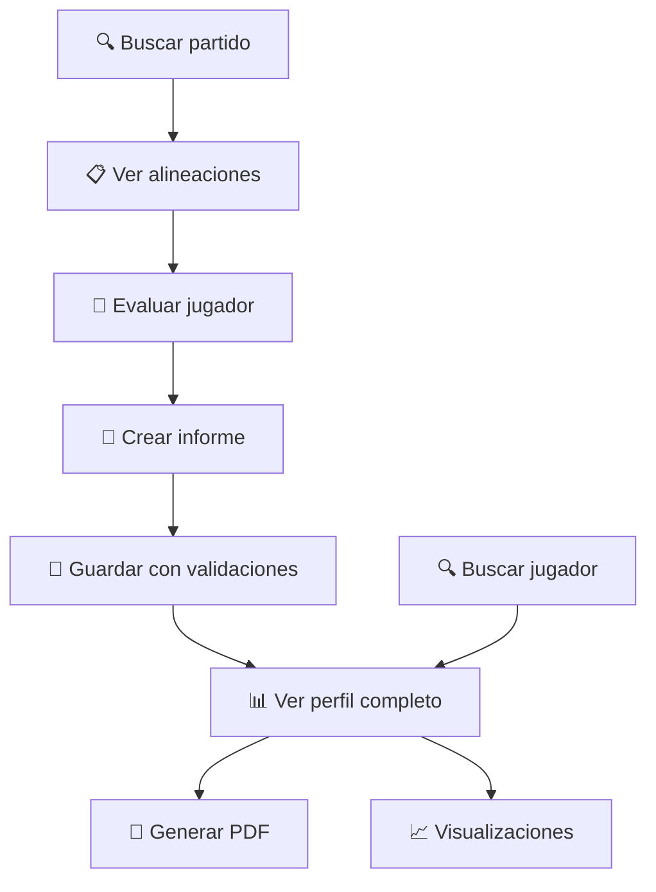

# 🏆 CAC Web Scouting

<div align="center">
  
  
  **Plataforma profesional de scouting del Club Atlético Central**
  
  *Para scouts, analistas, entrenadores y dirección deportiva*

  [](https://python.org)
  [](https://streamlit.io)
  [](https://sqlite.org)
  [](LICENSE)
</div>

---

## 🎯 **Funcionalidades principales**

### 📊 **Gestión de jugadores**
- **Catálogo completo**: foto, datos biográficos, equipo actual, características físicas
- **Métricas avanzadas**: ELO, valor de mercado, trayectoria por temporadas
- **Scraping automático**: datos actualizados desde BeSoccer
- **Detección inteligente de duplicados**: evita registros redundantes

### ⚽ **Scouting de partidos**
- **Alineaciones en tiempo real**: descarga directa desde BeSoccer
- **Evaluación rápida**: botón directo desde alineaciones a informe
- **Contexto automático**: rival, fecha, temporada pre-rellenados

### 📝 **Informes profesionales**
- **Valoraciones por categorías**: plantillas específicas por posición
- **Observaciones cualitativas**: notas detalladas del scout
- **Adjuntos multimedia**: vídeos, imágenes, documentos
- **Validación de datos**: no permite informes vacíos

### 📄 **Exportación PDF**
- **Informes individuales**: diseño profesional con métricas visuales
- **Resumen inteligente**: análisis con IA de todos los informes del jugador
- **Cache optimizado**: regeneración instantánea si no hay cambios
- **Branding corporativo**: colores y logo del club

### 📈 **Visualizaciones avanzadas**
- **Radares individuales**: percentiles por posición
- **Comparación multi-jugador**: hasta 5 jugadores simultáneos
- **Análisis por equipos**: métricas agregadas por club
- **Evolución temporal**: gráficos de rendimiento y ELO

---

## 🚀 **Instalación rápida**

### **Requisitos previos**
- **Python ≥ 3.10**
- **Ollama** en local ([Instalar](https://ollama.ai))
- **Modelo LLM** instalado (recomendado: `llama3`)

### **Setup paso a paso**

```bash
# 1️⃣ Clonar repositorio
git clone <URL_DEL_REPO>
cd cac-web-scouting

# 2️⃣ Entorno virtual
python -m venv .venv

# Activar entorno
# Linux/macOS:
source .venv/bin/activate
# Windows:
.\.venv\Scripts\activate

# 3️⃣ Instalar dependencias
pip install -r requirements.txt

# 4️⃣ Configurar Ollama (terminal separada)
ollama serve
ollama pull llama3

# 5️⃣ Ejecutar aplicación
streamlit run Home.py
```

> 🌐 **Acceso**: http://localhost:8501

---

## 🏗️ **Arquitectura del proyecto**

```
📁 cac-web-scouting/
├── 🏠 Home.py                    # Página principal y login
├── 📄 pages/
│   ├── 1_📂_Catálogo.py         # Búsqueda y listado de jugadores
│   ├── 2_⚽_Scouting_Partidos.py # Alineaciones y evaluación rápida
│   ├── 3_📊_Informes.py         # Creación/edición de informes
│   ├── 4_🧾_Perfil_Jugador.py   # Perfil completo + descargas PDF
│   ├── 5_📈_Visualizaciones.py  # Radares, comparaciones, estadísticas
│   └── 6_📋_Logs.py             # Sistema de logs y debugging
├── 🗄️ models/
│   └── database.py              # DatabaseManager (SQLite + thread-safe)
├── 🛠️ utils/
│   ├── scraping.py              # Scraping BeSoccer con cache
│   ├── besoccer_scraper.py      # Alineaciones y partidos
│   ├── pdf_export.py            # Generación PDF + IA (Ollama)
│   ├── styles.py                # Sistema de diseño CSS
│   ├── simple_logging.py        # Logging estructurado
│   └── matches_adapter.py       # Adaptador para partidos
├── 🎨 assets/
│   ├── Escudo CAC.png           # Logo del club
│   └── identidad_MPR_2.png      # Branding adicional
├── 💾 data/                     # Generado automáticamente
│   ├── scouting.db              # Base de datos SQLite
│   ├── exports/                 # PDFs generados
│   └── uploads/                 # Archivos adjuntos
└── 📋 logs/                     # Logs del sistema
```

---

## 💻 **Uso de la aplicación**

### **1. Autenticación**
- Login obligatorio para acceder a todas las funcionalidades
- Gestión de usuarios en base de datos SQLite

### **2. Flujo de trabajo típico**



### **3. Tipos de informes**

| Tipo | Descripción | IA | Gráficos |
|------|-------------|-----|----------|
| **Individual** | Un partido específico | ❌ | ✅ Barras de valoración |
| **Resumen** | Todos los informes del jugador | ✅ Ollama | ✅ Evolución temporal |

---

## 🎛️ **Configuración avanzada**

### **Variables de entorno**
```bash
# Modelo de IA (opcional)
export OLLAMA_MODEL=llama3

# URL de Ollama (opcional)
export OLLAMA_URL=http://localhost:11434/api/generate
```

### **Personalización del club**
- **Logo**: Reemplazar `assets/Escudo CAC.png`
- **Colores**: Modificar `utils/styles.py` → `COLORS`
- **Plantillas**: Editar `TEMPLATES` en `pages/3_Informes.py`

---

## 🔧 **Tecnologías utilizadas**

<table align="center">
  <tr>
    <td align="center"><strong>Frontend</strong></td>
    <td align="center"><strong>Backend</strong></td>
    <td align="center"><strong>Data & IA</strong></td>
  </tr>
  <tr>
    <td>
      • Streamlit<br>
      • CSS personalizado<br>
      • Plotly & Matplotlib<br>
      • mplsoccer
    </td>
    <td>
      • SQLite (thread-safe)<br>
      • BeautifulSoup<br>
      • Requests + cache<br>
      • ReportLab (PDFs)
    </td>
    <td>
      • Pandas & NumPy<br>
      • Ollama (local LLM)<br>
      • Scraping BeSoccer<br>
      • Análisis percentiles
    </td>
  </tr>
</table>

---

## 📱 **Screenshots**

<details>
<summary>🖼️ <strong>Ver capturas de pantalla</strong></summary>

### Página de informes


### Perfil de jugador


### Visualizaciones


</details>

---

## 🐛 **Debugging y logs**

La aplicación incluye un sistema de logging estructurado:

- **📋 Página de logs**: Acceso desde la interfaz web
- **🗂️ Archivos**: `logs/scouting_app_YYYY-MM-DD.log`
- **🔍 Filtros**: Por nivel (INFO/WARNING/ERROR) y módulo
- **🗑️ Limpieza**: Automática de logs > 7 días

---

## 🤝 **Contribuir**

### **Áreas de mejora**
- [ ] **Integración con APIs**: Transfermarkt, FBref
- [ ] **Modelos IA**: Soporte para otros LLMs locales
- [ ] **Exportación**: Excel, Word, PowerBI
- [ ] **Métricas**: xG, xA, PPDA avanzadas
- [ ] **Visualizaciones**: Mapas de calor, redes de pases

### **Proceso de contribución**
1. Fork del repositorio
2. Crear rama: `git checkout -b feature/nueva-funcionalidad`
3. Commit: `git commit -m 'feat: añadir nueva funcionalidad'`
4. Push: `git push origin feature/nueva-funcionalidad`
5. Crear Pull Request

---

## 📋 **Roadmap**

### **v2.0 (Próximo)**
- 🔄 **Sincronización automática**: Actualizaciones programadas desde BeSoccer
- 🎨 **Dashboard ejecutivo**: KPIs y métricas del departamento
- 📊 **Comparación con mercado**: Benchmarking automático
- 🤖 **IA mejorada**: Recomendaciones de fichajes

### **v2.1 (Futuro)**
- 📱 **App móvil**: Scouting desde el campo
- 🌍 **Multi-idioma**: Inglés, portugués
- ☁️ **Cloud**: Despliegue en AWS/GCP
- 🔗 **Integraciones**: Wyscout, InStat

---

## 📞 **Soporte**

- **📧 Email**: perezrudamanuel@gmail.com
- **💬 Issues**: [GitHub Issues](../../issues)
- **📚 Wiki**: [Documentación completa](../../wiki)

---

<div align="center">
  <strong>Desarrollado con ❤️ para el Club Atlético Central</strong><br>
  <em>Transformando el scouting tradicional con tecnología moderna</em>
</div>